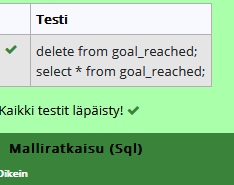

# Koostetieto kyselyt harjoitukset
# tehtävä1
select max(elevation_ft)
from airport;

# tehtävä2
select continent, count(*)
from country
group by continent;

# tehtävä3
select screen_name, count(*)
from game, goal_reached
where id = game_id
group by screen_name;

# tehtävä4
select screen_name
from game 
where co2_consumed in(
select min(co2_consumed) 
from game 
);

# tehtävä5
select country.name, count(*)
from country, airport
where airport.iso_country = country.iso_country
group by country.iso_country
order by count(*) DESC
limit 50;

# tehtävä6
select country.name
from airport, country
where airport.iso_country = country.iso_country
group by country.iso_country
having count(*)>1000;

# tehtävä7
select name
from airport
where elevation_ft in (
select max(elevation_ft)
from airport);

# tehtävä8
select name
from country
where iso_country in(
select iso_country
from airport
where elevation_ft in(
select max(elevation_ft)
from airport)
);

# tehtävä9
select count(*)
from goal
where id in(
select goal_id
from goal_reached
where game_id in (
select id
from game
where screen_name = "Vesa"));

# tehtävä10
select name
from airport
where latitude_deg in(
select min(latitude_deg)
from airport
);

# Päivityskyselyt harjoitukset:

# tehtävä1
update game
set location = (select ident from airport where name = "Nottingham Airport"),co2_consumed = co2_consumed+500
where screen_name = "Vesa";

# tehtävä 2

# tehtävä 3
delete from goal_reached;

# tehtävä 4
delete from game;

